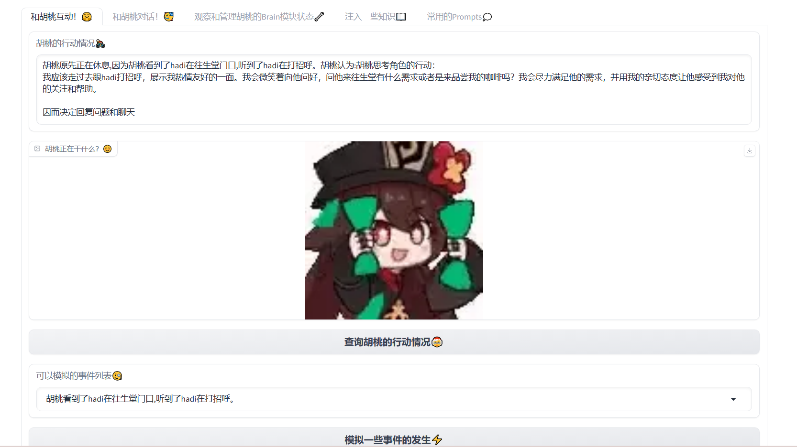
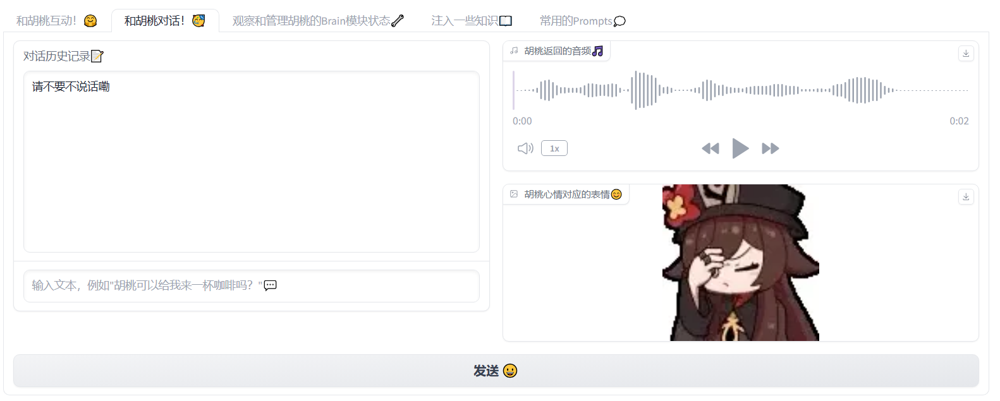
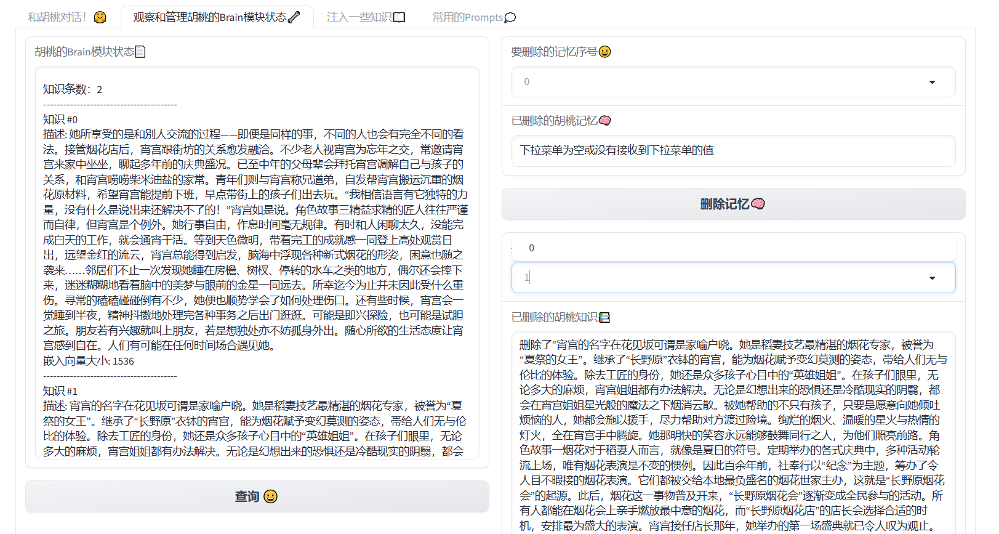
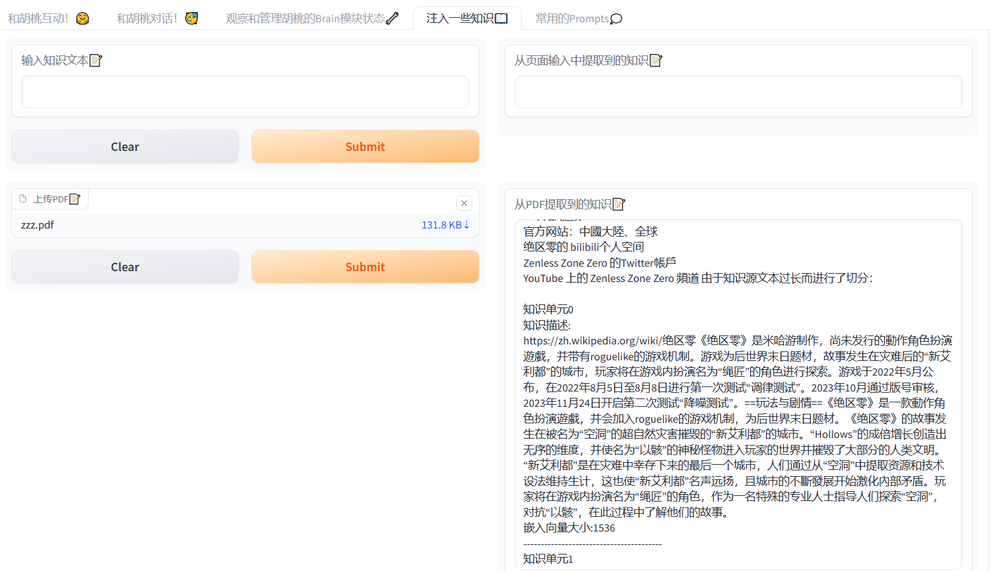

# 🤖 LucyAgent：基于LLM的智能代理设计实践

## 🎉 基本介绍

## 💬 Gradio Demo一览










## 🌟 主要特性
- 🧠 基于Perception， Brain， Action的框架
- 📚 简单的记忆流与知识库
- 🔧 工具库（例如Wiki检索，处理PDF📝）
- 🎮 使用LLM驱动FSM（例如心情，行为）
- 👩‍🔧 细节优化（例如平滑文本分割，子知识结构）
- ✍️ 风格化人设的prompt设计
- 🎨 可交互的Gradio Demo
- 🚫 不依赖LangChain
- 🚫 不依赖向量数据库
- 🚫 模型调用基于API调用实现，无本地部署

## 🧠 Brain模块

### 📝 记忆流与知识库

#### 🧩 记忆单元
- 记忆单元由其记忆描述、创建时间、描述的嵌入构成。
- 记忆流是记忆单元的简单列表，可以存储最近的记忆，但具有数量上限（`MEMORY_LIMIT`）。

```python
memory = {
    "description": "记忆描述",
    "create_time": "创建时间",
    "embedding": "嵌入向量",
}
```

#### 🌐 记忆相关方法
- 🆕 创建记忆 (`create_memory`)：根据输入和输出创建一个记忆摘要，并返回记忆字典。
- ➕ 添加记忆 (`add_memory`)：将记忆添加到记忆流中。当记忆流达到上限时，会触发记忆总结。
- 📝 总结记忆 (`summarize_memory`)：基于最新的记忆，找到与其最相似的记忆对象，进行一次总结，并添加到记忆流中。
- ❌ 删除记忆 (`del_memory`)：按索引删除记忆、清空所有记忆或删除匹配特定查询的记忆。
- 👀 展示记忆 (`show_memory`)：列出所有记忆摘要和相关信息。
- 🔍 搜索记忆 (`search_memory`)：找到与给定嵌入向量最匹配的记忆。

#### 📚 知识单元
- 知识单元由其知识文本、文本的嵌入构成，以及可能包含子知识文件路径。
- 知识库是知识单元的集合，便于高效检索。

```python
knowledge = {
    "text": "知识文本",
    "embedding": "嵌入向量",
    "sub_knowledge": "子知识文件路径（可选）",
}
```

#### 📖 知识相关方法
- 🧠 提取知识 (`extract_knowledge`)：从文本中提取知识点。
- ➕ 添加知识 (`add_knowledge_list`)：将一个知识对象列表添加到知识库中，并记录日志。
- ➕ 添加知识 (`add_knowledge_from_text`)：根据提供的文本添加一个知识对象到知识库中，并记录日志。
- ➕ 添加知识 (`add_knowledge_with_sub_knowledge`)：为具有子知识列表的知识总结创建一个JSON文件来存储子知识，并将知识总结添加到知识库中。
- ❌ 删除知识 (`del_knowledge`)：按索引删除知识或清空所有知识。如果知识单元有子知识文件，也会一并删除。
- 👀 展示知识 (`show_knowledge`)：列出所有知识文本、嵌入向量大小、子知识链接和子知识文本（如果有）。
- 🔍 搜索知识 (`search_knowledge`)：找到与给定查询向量最匹配的知识文本。如果知识单元有子知识文件，也会搜索子知识。

### 🎭 角色配置说明

- 📛 `name`: 角色的姓名。
- 🌱 `seed_memory`: 角色的背景故事。
- 💬 `language_style`: 角色的语言风格。
- 🧠 `basic_knowledge`: 角色的基础知识，初始为空数组。
- 📚 `memory_stream`: 角色的记忆流，初始为空数组。
- 😄 `mood_list`: 角色fsm的可能心情列表。
- 😃 `emoji_list`: 角色fsm心情对应的表情包列表。
- 🕵️‍♀️ `action_state_list`:角色fsm的可能行动列表。

