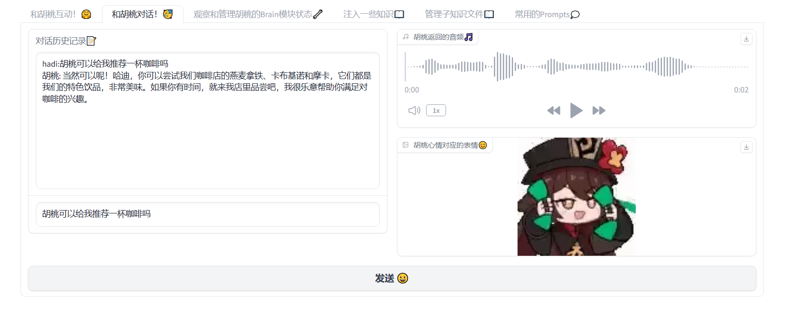

# 🤖 LucyAgent：基于LLM的智能代理设计实践

## 🎉 基本介绍

## 🌟 主要特性
- 🧠 基于Perception， Brain， Action的类框架
- 📚 简单的记忆流与知识库，原生JSON实现
- ✍️ 基于想法的CoT风格化对话，多要素的prompt设计
- 🔧 工具库（例如Wiki检索，处理PDF📝）
- 🎮 使用LLM驱动FSM（例如Agent心情，行为欲望）
- 🎨 可交互的Gradio Web Demo
- 👩‍🔧 细节优化（例如平滑的文本分割，多级RAG子知识结构）

## 🌊不需要的框架
- 🚫 不依赖LangChain
- 🚫 不依赖向量数据库
- 🚫 模型调用基于API调用实现，无本地部署

## 💬 Gradio Demo一览



## 🔧 相关技术报告

[LLM应用：利用子知识结构实现多级RAG](https://zhuanlan.zhihu.com/p/671429602)

[基于Embedding相似度的对话好感度分析](https://zhuanlan.zhihu.com/p/672262215)

[LLM风格化对话中的Prompt工程](https://zhuanlan.zhihu.com/p/671966233)

[Agent综述：《The Rise and Potential of Large Language Model Based Agents：A Survey》相关解读](https://zhuanlan.zhihu.com/p/671599535)

[LLM知识库导入的细节：平滑的文本分割](https://zhuanlan.zhihu.com/p/671295504)

## 🚕上手

检查apis.py文件，选择对应服务，设置相关api-key环境变量。设置完成后：
```
python web_demo.py
```
由于项目结构简单，需要更改角色配置时，查看resource文件夹，对hutao.json和其他文件进行修改。
亦可使用web_demo.py在web界面上改变角色配置。

## 🛴提交代码

```
git pull origin main
git add .
git commit -m "message"
git push origin dev
```

## 🚄Todo

- 重构apis.py：应该把多个服务集中在一个接口，应当尝试异步
- 重构web_demo.py：硬编码过多，demo代码框架不好，代码质量不高
- 重构agent_fsm.py:LLM决策状态部分是字符串完全匹配，应该尝试增强一下鲁棒性
